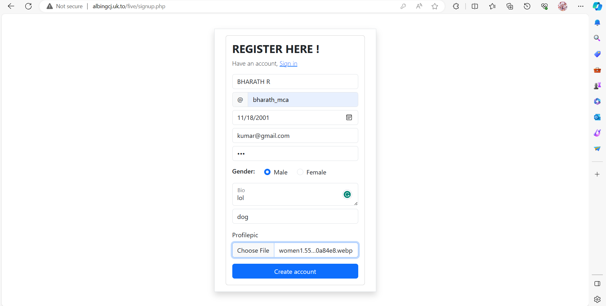
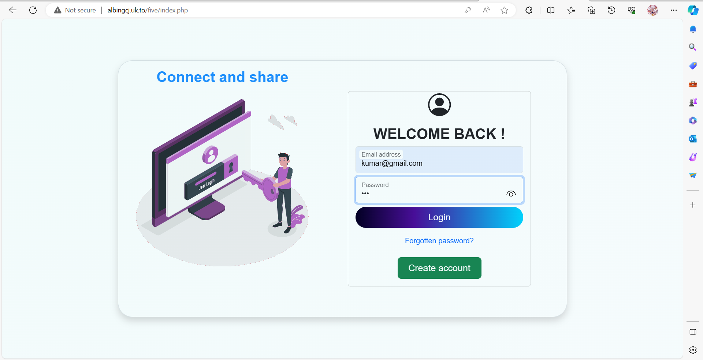
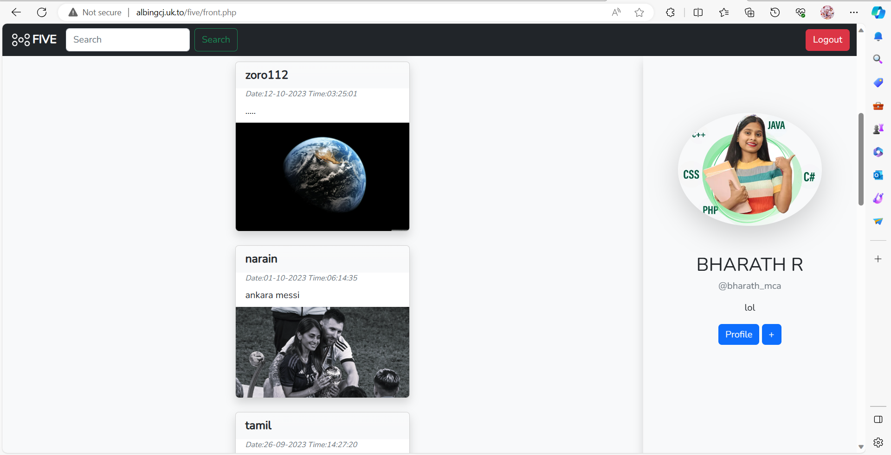
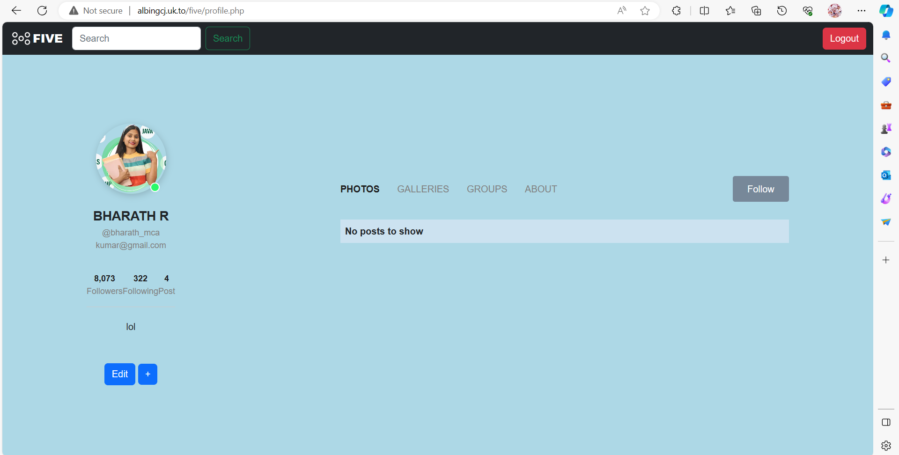
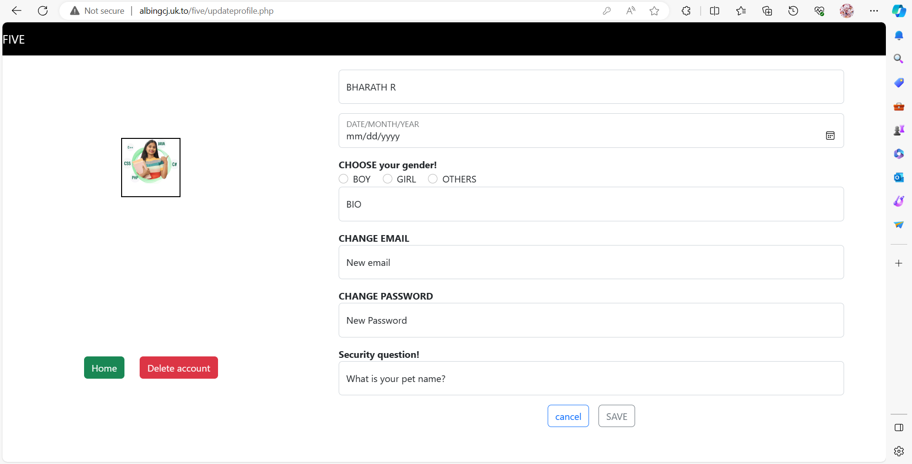

# FIVE

## Project Overview

Welcome to FIVE! This web application is designed to provide a user-friendly platform with various features to meet the needs of both administrators and users.

## Table of Contents

1. [User Registration](#1-user-registration)
2. [User Login](#2-user-login)
3. [User Landing](#3-user-landing)
4. [User Profile](#4-user-profile)
5. [User Edit](#5-user-edit)

## Technologies Used

- **PHP:**
  
  
- **HTML:**
  
  
- **Bootstrap:**
  
  
- **CSS:**
  

## 1. User Registration

The signup page is where users can register and create an account. It's the starting point for users to join the platform, ensuring a smooth onboarding process.

## 2. User Login

The user login page is the gateway for registered users to access their accounts. Secure and user-friendly, this page ensures a convenient login process for users returning to the platform.

## 3. User Landing

The user landing page is the initial interface users encounter after logging in. It offers an engaging experience similar to popular platforms like Instagram. Here, users can explore a diverse array of articles from various contributors.

## 4. User Profile

The user profile page is where users can view and manage their personal details. It provides a comprehensive overview of individual user information, fostering a sense of community within the platform.

## 5. User Edit

Users can personalize their experience by accessing the user edit page. Here, users can edit and enhance their details, keeping their profiles current and reflective of their evolving preferences.

## Getting Started

To get started with FIVE, follow these steps:

1. Clone the repository.
2. Set up your database and configure connection details.
3. Open the project in your preferred web development environment.
4. Start exploring the various features!

Feel free to reach out for any assistance or inquiries.

## Contributors

- Sabhari
- Sriram
- Sabhari

Happy coding!
